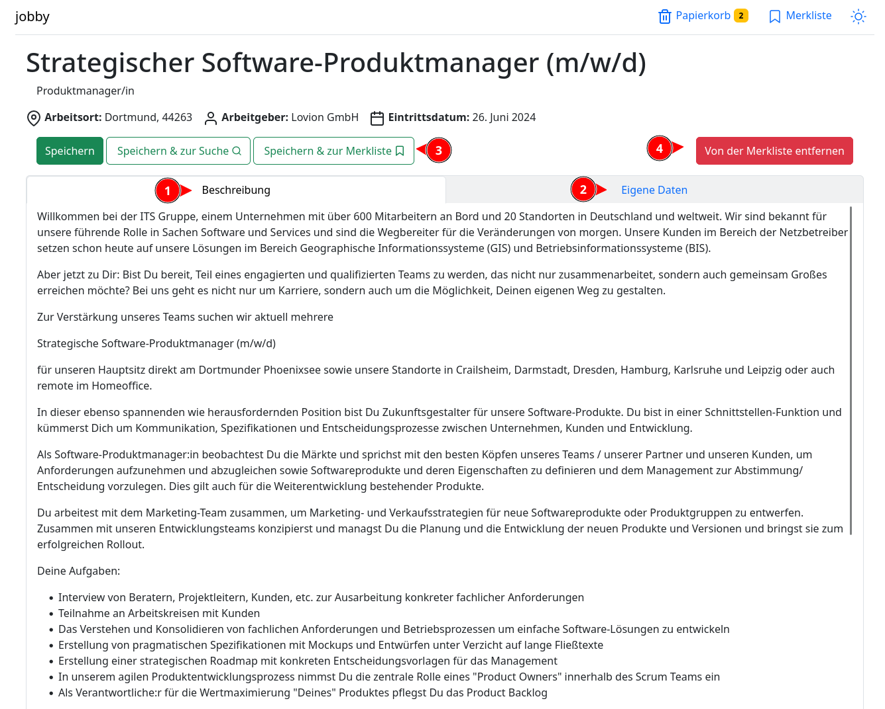
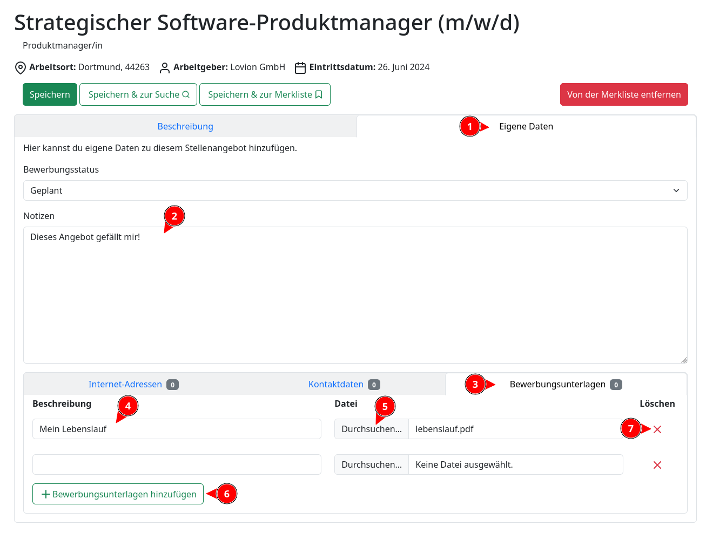
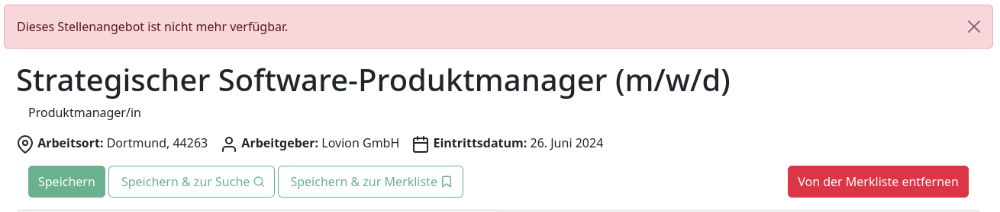

# Detailansicht

Klickst du auf den Link eines Ergebnisses der [Suche](suche.md), oder auf ein Stellenangebot in
deiner [Merkliste](merkliste.md), so gelangst du zu der Detailansicht dieses Angebots.

Hier kannst du dir alle verfügbaren Informationen zun dem Stellenangebot anschauen.
Dazu gehört die detaillierte Job-Beschreibung (1) (falls vorhanden) und eventuell Daten, die du selbst hinzugefügt
hast (2).

Es stehen drei Knöpfe zur Verfügung (3), mit denen du dir das Stellenangebot merken bzw. abspeichern kannst.

- "Merken" (bzw. "Speichern"): fügt das Angebot zu deiner Merkliste hinzu oder aktualisiert ein bereits existierendes
  Stellenangebot
- "Merken & zur Suche": speichert ab und schickt dich zu der Seite mit den Suchergebnissen
- "Merken & zur Merkliste": speichert ab und schickt dich zu der Merkliste

Befindet sich das Stellenangebot auf der Merkliste, kannst du den Knopf "Von der Merkliste entfernen" (4) benutzen, um
das Angebot von der Merkliste zu entfernen.

## Eigene Daten hinzufügen

Du kannst eigene Daten zu dem Stellenangebot hinzufügen. Klicke dazu auf den Reiter "Eigene Daten" (1).
In dem folgenden Formular kannst du nun deine Notizen (2) und ähnliches eintragen.

Um zum Beispiel Bewerbungsunterlagen hochzuladen, klicke unten auf den Reiter "Bewerbungsunterlagen" (3). In dem
optionalen Feld "Beschreibung" (4) kannst du eine kurze Beschreibung der Datei angeben. Mit "Datei" (5) kannst du die
Datei auswählen, die du hochladen möchtest. Um weitere Dateien hochzuladen, klick auf den Knopf "Bewerbungsunterlagen
hinzufügen" (6). Der "Löschen" Knopf (7) markiert eine Zeile zum Entfernen; wenn du dir das Stellenangebot merkst oder
abspeicherst, wird diese Zeile gelöscht.

## Stellenangebot nicht mehr verfügbar

Wenn das Stellenangebot nicht mehr verfügbar ist, sind die Speichern-Knöpfe gesperrt und eine Warnung wird angezeigt.
Das abgelaufenes Stellenangebot kannst du nicht zu der Merkliste hinzufügen:

