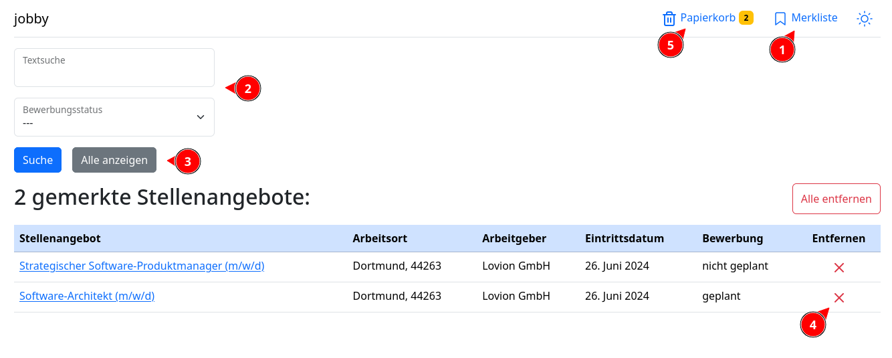

# Die Merkliste

Die Merkliste erreichst du, unter anderem, über den "Merkliste" Knopf (1) oben auf der Seite.

Hier findest du alle Stellenangebote, die du vorgemerkt hast. Du kannst auf ein gemerktes Stellenangebot klicken, um zu
dessen [Detailansicht](detail.md) zu gelangen.

Über der Merkliste findest du ein kleines Suchformular (2). Gebe in dem Feld "Textsuche" deinen Suchbegriff ein und
klicke dann auf "Suche".
Die gemerkten Angebote werden daraufhin nach dem Begriff durchsucht. Um wieder die vollständige Merkliste anzuzeigen,
klicke auf den Knopf "Alle Anzeigen" (3).

Mit einem Klick auf den "Entfernen" Knopf, dem roten X, (4) kannst du ein Stellenangebot von der Merkliste entfernen.

Entfernst du ein Stellenangebot wird dieses direkt von der Datenbank gelöscht, es sei denn, du hast eigene Daten zu dem
Angebot hinzugefügt. In dem Fall findest du das Stellenangebot im [Papierkorb](papierkorb.md) (5) wieder, um deine Daten
zu erhalten.
