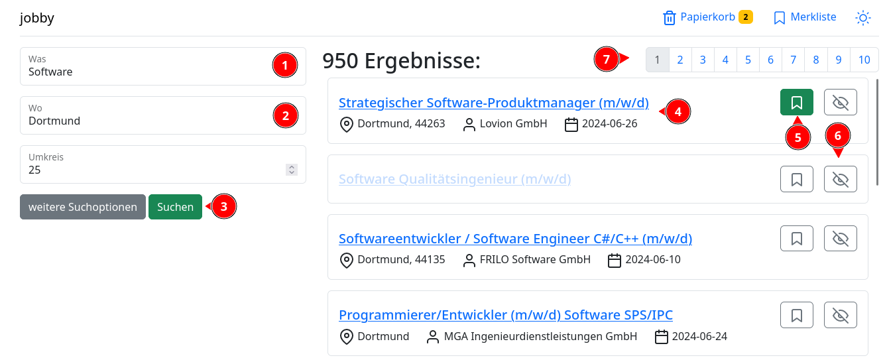

# Die Suche

Auf der [Suchseite]( http://localhost:8787/jobby/suche/) kannst du nach Stellenangeboten suchen. Dazu gebe im Suchfeld "
was" (1) den Beruf oder ein Schlagwort ein. Im Feld "wo" (2) gibst du deinen gewünschten Arbeitsort ein. Mit einem Klick
auf "Suchen" (3) startest du die Suche.

Jedes Ergebnis präsentiert einen Link und die wichtigsten Daten zu dem Stellenangebot (4). Der Link führt dich zu
der [Detailansicht](detail.md) des Stellenangebots führt. In der Detailansicht findest du unter anderem die Beschreibung
des Stellenangebots und kannst deine eigenen Informationen hinzufügen.

Neben den Ergebnissen findest du außerdem noch zwei Knöpfe. Der erste Knopf mit dem Lesezeichen Symbol (5) fügt das
Ergebnis zu deiner Merkliste
hinzu. Mit dem zweiten Knopf (6) kannst du Ergebnisse für zukünftige Suchen etwas verstecken lassen.

Über der Ergebnisliste findest du Links (7) zu den Seiten, die die weiteren Suchergebnisse beinhalten.

Du kannst zu der Suchseite zurückgelangen, wenn du im Kopf der Seite auf "jobby" klickst.

## Links

- Die Suchseite: [http://localhost:8787/jobby/suche/](http://localhost:8787/jobby/suche/?was=Software&wo=Dortmund&umkreis=25&page=1&size=50&suche=Suchen)
